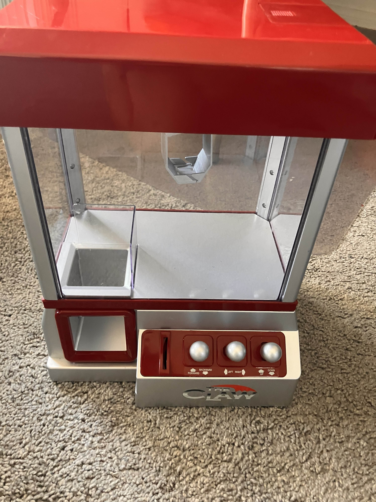
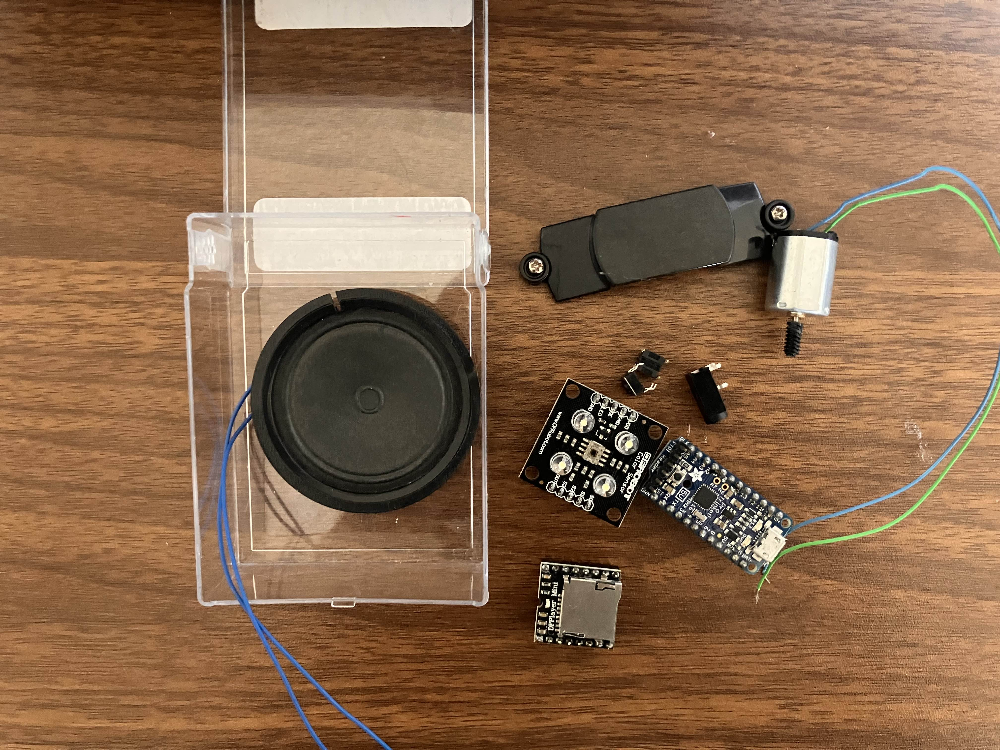

# June 26th: Started planning

Just started my project! I'm thinking of making a music player that looks like a record player that plays different songs depending on what color the record is.

I have a toy crane that has really **really** loud music which honestly isn't the best. I've wanted to take the speaker out for a while so I can reuse it for something else and this project is perfect for it :]

Unfortunately! The speaker is huge compared to the box I'm planning to put everything in. So either I'll have to use something else or just not add it in.
It isn't too bad of a problem since I plan to add something to plug some speakers into but it'll still nice to have

**Total time spent: 2h**
